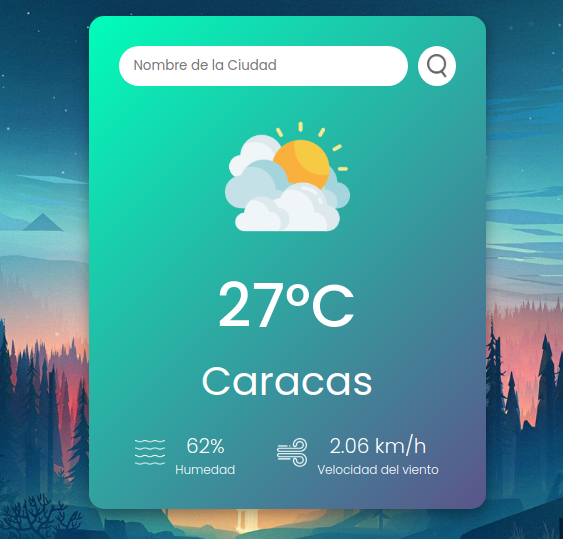

# weather-app
https://giancarlo0811.github.io/weather-app/

Sencilla app que muestra el tiempo actual de una ciudad usando Weather API de OpenWeather.
Datos mostrados: temperatura, ciudad, humedad y velocidad del viento.

